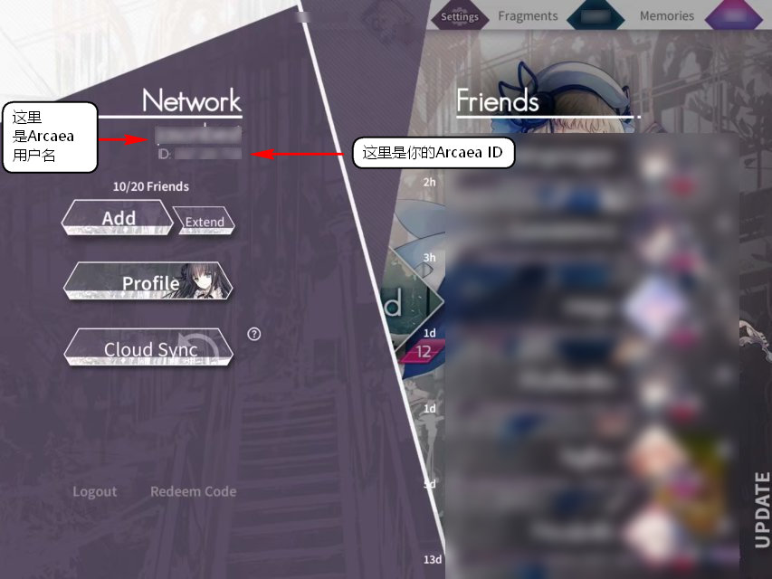

---
tags:
  - Bot 可用模块
hide:
  - navigation
---

# Arcaea模块

!!! warning "严正提示"
	由于官方严厉打击查分器等工具，请勿外传本插件生成的图片和文字信息！（小范围在QQ群中使用是允许的）可能导致的封号行为后果自负

*你自己Arcaea打成什么样心里没有什么数吗233*

[返回模块列表](index.md)

## Arcaea是什么？
> 真人面对面收割，美女角色在线掉分，发狂玩蛇新天地   
> 				    —— [Arcaea中文维基](https://wiki.arcaea.cn/index.php?title=%E9%A6%96%E9%A1%B5)					

好，言归正传，Arcaea是一款音乐游戏，主要特征是3D的下落式音游，有地面单键、天空单键、地面长条和音弧、音轨等要素，玩家通过游玩歌曲以增加经验。  
除了歌曲游玩以外，Arcaea可以通过“世界模式”来解锁更多歌曲，更可通过氪金购买以享受更多的游玩体验。游戏也有丰富的故事剧情要素等待我们的探究。

## 这个模块是干什么的？
* 你可以用它查询到你最近的游玩记录和最好成绩，还可以体验一些有趣的东西！
* 目前仅支持以简单文字显示查询到的结果。（2020.4）

## 使用方法
* 开启模块
	```text
	##install arcaea //安装模块
	##enable arcaea  //启用模块
	```
* 触发词方式
	```text
	<本群触发词> <arcaea|arc|韵律源点> <action> <params>
	```
	* `arcaea`或`arc`或`韵律源点`为模块级触发词，必须输入。
	* 支持的`action`取值
		- 显示模块帮助：`/help` 或 `/?`
			* 将显示模块指令帮助
		- 绑定要查询的Arcaea帐号：`/bind <userid>`
			* 别名：`/arcbind` 或 `/bindarc`
			* 建立起QQ号与Arcaea帐号的映射关系，方便查询
			* 允许覆盖绑定
			* 需要提供userID作为参数！
				- userID为9位数字，可以在游戏的Networks（网络）选项中查询得到

				

			* 需要绑定帐号才可正常进行后续的查询操作

		- 解除绑定Arcaea帐号：`/unbind`
			* 别名：`/unbindarc` 或 `/arcunbind` 或 `/bind -1`
			* 取消当前QQ号与Arcaea帐号的映射关系，以方便重新绑定帐号
		- 查询最佳：`/best <song> <diff>`
			* 别名：`/bestplay`
			* 查看某歌曲某难度最佳成绩
			* song中可以填歌曲别名或本名，唯一需要注意的是不要有空格！
			* diff指Arcaea中歌曲的难度，简单是PST，一般是PRS，困难是FTR，挑战难度是BYD
				- 这里可以接受小写形式pst，prs，ftr或byd；也可以接受数字值0，1，2或3
		- 查询最近：`/recent`
			* 输入`arcaea`指令时默认的选项
			* 查看自己的最近成绩
		- 云游玩：`/cloudplay <song> <diff>`
			* *如果板子不在旁边，但又想过过手瘾，那就云游玩一把好了！*
			* song和diff的定义同`/best`指令
			* 如同一般的结算一样，会输出你的游玩成绩，*与官方结算完全一致，开心就好*
		- 随机：`/random [pack|song]`
			* *今日制霸目标（不）*，小型的随机指令
			* 抽取范围：`pack`为曲包，`song`为全曲
		- 剧情解锁密码：`/connect <params>`
			* 来自于 https://lowest.world/connect 的解锁密码，用于开启风暴对立的剧情故事
			* 直接输入`/connect`，即可即时获取当前的解锁密码
			* 或者，输入`/connect /subscribe`，订阅每日提醒
				- 新的解锁代码将于每日北京时间8点左右自动发送至群中
				- 要退订提醒，请使用`/connect /unsubscribe`


* 私聊方式
	- 查询最近：`arcaea查最近`
		* 同名指令：`recent`
		* 查看自己的最近成绩（绑定状态下）
	- 查询最佳：`arcaea查最棒 <song> <diff>`
		* 同名指令：`best`
		* 绑定状态下，查看自己的最佳成绩
