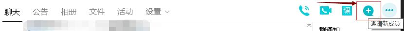
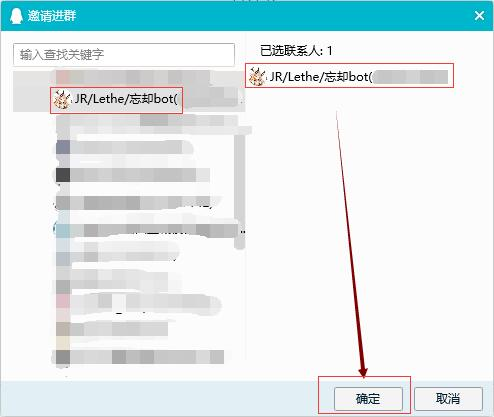
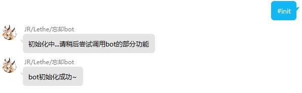

# 当我添加bot成功后，该怎么做？

## 快速记住bot的指令<a id="remember"></a>

* 所有的指令之间都以<strong>空格</strong>分隔
* “快捷方式”未启用前，所有的指令前需要加入本群的“[触发词](interact-with-group-msg/triggers.md)”，才能得到指令的响应
	- “[触发词](interact-with-group-msg/triggers.md)”与其他指令之间同样要以<strong>空格</strong>分隔
* 特殊指令以符号`#`为开头
	- 以`#`打头的指令为[群管理](manage-group-with-bot/index.md)相关功能
	- 以`##`打头的指令为[模块管理](manage-group-with-bot/managing-modules.md)相关功能
* 群中的指令大多数符合`触发词 模块id [动作] [参数]`的形式
	- 参数是可选的
	- 如果相应模块不是“启用”状态，则bot不会有任何响应
	- 不会使用指令？目前，一般需要动作调用的地方，若出现非法参数即会默认显示帮助，请检查你对应位置的参数是否正确

	!!! note "返回帮助信息的解读"
		* 外部包含的尖括号和方括号在实际调用时不必打上  
		* 一般地，`<>`中的内容为变量，根据调用情况不同而不同，且此部分内容是必须填写的  
		* `[]`中是选择的值，选项以`|`分割，该位置只能填写一系列选择值的一个  
		* 没有任何符号包裹的单词值是唯一的，且必填  
		* 以`/`打头的指令根据具体情况可分为如下含义：
			- 后面不跟任何参数，则称为“开关值”，此时这个指令可写可不写
			- 后面对此参数传值，此时这个指令必须填写

## 将它邀请入群<a id="invite"></a>
1. 在要拉入bot的群中，点击右上角的“邀请新成员”

2. 选择此bot，然后点击右下角的“确定”  
  
3. 如果此群没有被列入黑名单，则请求会自动通过  
4. 在群内向bot发送`#init`以初始化本群设置  
	```text
	#init
	无需任何其他字符或选项
	```
	
	* 无需@bot
	* 若产生了“bot初始化成功~”的回复，即可继续使用本bot功能
		- 否则，请稍后重新发送`#init`指令或私聊bot进行问题反映

## 开始使用bot<a id="start-using"></a>
* 善用`bot function`和`bot help`
	- 前者可以查看当前群中所有功能的列表，后者可以查看bot总帮助
* 查阅[模块列表](available-modules/index.md)以获取所需要的功能列表
